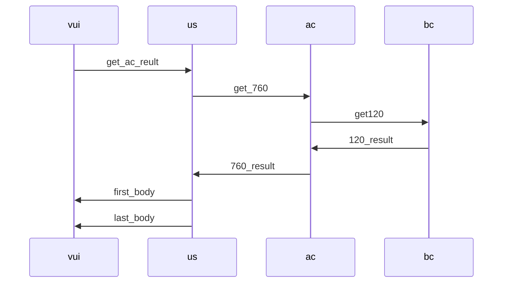
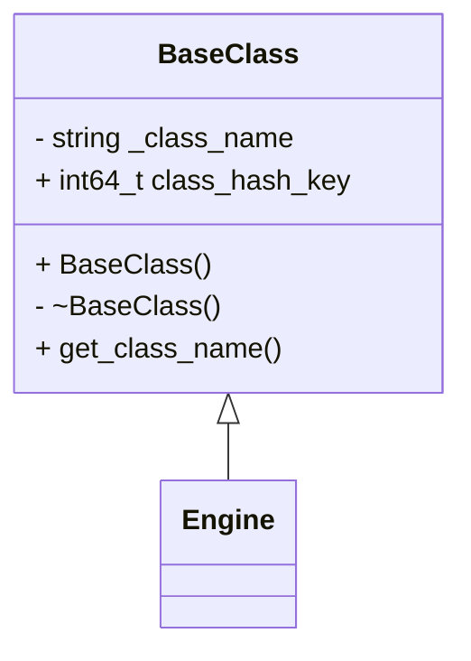

- Direct Graph

```mermaid
graph TD;//direct graph
A-->B;
A-->C;
A-->D;
D-->E;
```
- Sequence Graph

```mermaid
sequenceDiagram
vui->>us: get_ac_reult
us->>ac:get_760
ac->>bc:get120
bc->>ac:120_result
ac->>us:760_result
us->>vui: first_body
us->>vui: last_body
```

- class diagram

```mermaid
classDiagram
	BaseClass<|-- Engine
	
	BaseClass : + BaseClass()
	BaseClass : - ~BaseClass()
	BaseClass : - string _class_name
	BaseClass : + int64_t class_hash_key
	BaseClass : + get_class_name()
```